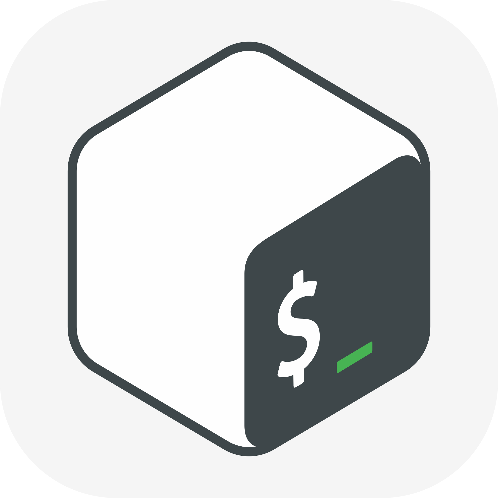

# Hi there, I'm Dmitry 🤘🏻

## About Me:

- 🪲 I currently work as a manual QA engineer 
- 📘 I'm in the process of learning **Java** and completed my studies at **[QA.GURU](https://qa.guru/)**
- 🌏 Languages: **Русский**, **English** (B1-B2)

## Languages & Tools I use:

 

## How to reach me:

<!---
frolov-d/frolov-d is a ✨ special ✨ repository because its `README.md` (this file) appears on your GitHub profile.
You can click the Preview link to take a look at your changes.
--->
